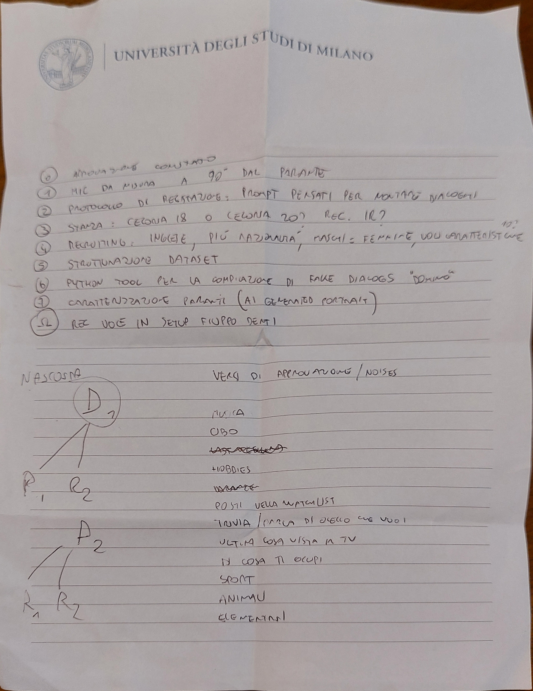

Lavoro di tesi:

Documentazione
[Documento](TESI.MD)

[Protocollo per il test](PROTOCOLLO.MD)

[Generatore di dialoghi pseudo-realistici in Python](PYGenerator.py)

Il codice:
  - permette all'utente di scegliere se inserire i files manualmente o impostare dei parametri per l'auto-generazione di dialoghi
  - Permette di inserire manualmente i files
  - eventuali ulteriori settaggi sono nel file di generazione come variabili globali

  

           

REMINDER di fare il backup:

