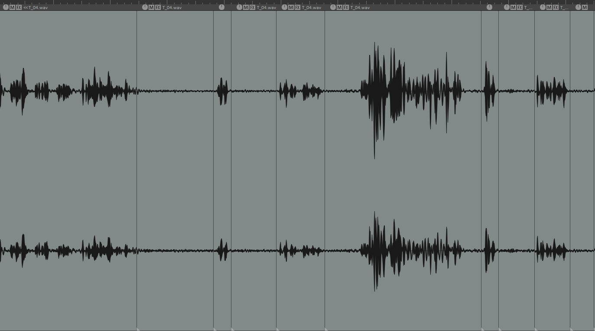

# Caso di studio

Nella ricerca nel campo dell'Informatica Musicale, la creazione di dataset audio per fini scientifici riveste un ruolo cruciale. 
Questa tesi si propone di delineare il processo di realizzazione di un dataset di files audio adoperati per scopi di ricerca presso il Laboratorio di Informatica Musicale (LIM) [^14]. 

# Introduzione
 
Il dataset sarà composto da dialoghi strutturati in forma di domande e risposte, interpretate da diversi partecipanti, con l'obiettivo di generare tracce di dialogo di lunghezza variabile il più verosimili possibile tra più individui. Tali tracce saranno impiegate per condurre esperimenti futuri presso il LIM. 

Saranno rilevati inoltre dalle registrazioni i tempi di risposta dei vari partecipanti al test, che verranno quindi confrontati con quelli riportati nella letteratura specializzata, al fine di valutarne la coerenza e l'aderenza alle dinamiche comunicative reali. 

Inoltre, si svilupperà un software ad hoc per la combinazione efficiente dei dialoghi, mirato a ottimizzare i tempi di produzione delle tracce audio e a soddisfare specifiche esigenze o requisiti. Il protocollo sperimentale per le registrazioni sarà rigorosamente definito, includendo una spiegazione dettagliata degli obiettivi della registrazione e delle istruzioni per una partecipazione coerente e consistente, al fine di garantire la coerenza e l'affidabilità dei dati raccolti.

# Stato dell'arte

# Tecnologie utilizzate
Per quanto concerne la registrazione in stanza insonorizzata, è stato scelto come software per la registrazione la DAW [^15].
E' stata quindi registrata per ogni partecipante una unica traccia contenente tutte le domande e le risposte.

Si è scelto di realizzare il codice per la generazione dei dialoghi in Python per la sua semplicità e flessibilità.
La versione utilizzata è Python 3.11.6.

Nello specifico è stato fatto uso di diverse librerie tra cui:
 - **soundfile**: per la lettura dei files da disco
 - **numpy**: per gestire i vari array di files sia per la concatenazione degli stessi, sia per 
 - **random**: per la generazione randomica  
 - **configparser** e **json**: per permettere all'utente la scelta la personalizzazione e i settaggi migliori per configurare l'esecuzione del codice. Va comunque sottolineato che il codice può funzionare anche senza i suddetti files, quindi con valori predefiniti.

Va sottolineato che comunque il software, una volta installata la versione corretta di python, nel caso in cui le librerie non siano già presenti, chiede all'utente se procederne all'installazione.

# Le registrazioni
## Attrezzatura e setup:

Come luogo di registrazione è stata scelta la stanza insonorizzata anecoica di celoria 22 (Malcangi).
La posizione del partecipante all'esperimento è nel centro della stanza. Sono stati usati due microfoni con risposta piatta, di cui uno frontale e l'altro angolato di 90° e posizionati entrambi a mezzo metro di distanza all'altezza della bocca per ricreare una impostazione ambisonic del secondo ordine.
La distanza dei microfoni è stata scelta per esigenze di distanza: ad un metro il partecipante sarebbe stato troppo vicino a due pareti e in una posizione che poteva ostruire il passaggio in ucita e quindi causare il movimento dei microfoni.
E' stata usata inoltre usata una scheda audio [^16] con gain a +26 e due microfoni a distanza di mezzo metro dal viso, uno frontale e uno laterale destra.
La registrazione dei due microfoni avviene in formato stereo. Con come uscita un file wav a 24bit e frequenza di campionamento 192khz.

Per aumentare il rendimento acustico della stanza sono stati inoltre aggiunti alcuni pannelli forniti dal LIM, come si vede nell'immagine sottostante.

Nota: Nell'immagine sottostante un microfono è posto su una mensola, quando, a seguito di misurazioni, è stato invece spostato su un treppiede che poggia sul pavimento per ridurre interferenze a bassa frequenza.

## Procedimento in stanza con i partecipanti

Uno dei problemi principali nell'esecuzione del nostro test è stata l'identificazione delle metodologie di registrazione in modo che: 
 - Le risposte fossero il più realistiche possibili all'interno dei limiti della concatenazione casuale
 - Non ci fossero **sovrapposizioni** tra audio dell'intervistatore e dell'intervistato
 - Fosse possibile osservarne anche i tempi di risposta per confermarne la veridicità o alla fine di una più completa raccolta dati per la generazione di dialoghi tra più persone 

Sono stati così selezionati 8 partecipanti: 4 maschi e 4 femmine, nessuno dei quali è madrelingua. Ad ogni partecipante è stato fatto firmare un modulo per il trattamento dei dati personali.
Il numero di domande scelte è 10 di argomenti generici. Si è scelto inoltre di fare un'ulteriore registrazione a un portamento diverso per ogni partecipante.

### L'ordine

Inizialmente abbiamo ipotizzato una struttura in cui venissero poste prima tutte le domande dall'intervistatore all'intervistato e che solo alla fine di tutto il ciclo di domande si proseguisse a far registrare le domande singole all'intervistato. 
Questa struttura però comportava un mancato mantenimento della tonalità di voce e tra ogni singola domanda e risposta, poichè spesso in un discorso, chi fa la domanda è colui che risponde a tale.
Inoltre le domande registrate potrebbero risultare tutte troppo uguali tra i vari partecipanti poiché l'intervistato sarà tentato di ripetere parola per parola la domanda originale.

La **soluzione** è quindi di ripetere la domanda *dopo* aver dato la risposta, così facendo l'intervistato probabilmente non si ricorderà l'esatta domanda, ma la deducerà dalla sua risposta; l'intervistato potrebbe non ricordarsi la domanda originale o potrebbe produrre una risposta non coerente. Sta all'operatore *eventualmente* intervenire valutandone la coerenza con la domanda originale.
La scelta delle domande non deve quindi essere **equivocabili** e **semplici**. 

Inoltre, per rendere le domande più simili a dialoghi tra più persone, si è scelto di inserire dei connettivi che potessero essere usate anche come domande iniziali (Prompt). 

Si è scelta quindi la formula:
 - Answer n: risposta alla domanda n
 - attesa di 5 secondi indicata dall'operatore
 - Prompt n: connettivo alla domanda n
 - attesa di 5 secondi indicata dall'operatore
 - Question n: domanda

### Tempi di pausa
Dalle ricerche [Analisi dei tempi di risposta](#analisi-dei-tempi-di-risposta) è stato appurato che il tempo di pausa tra domanda e risposta può ridursi fino a generare una sovrapposizione tra domanda e risposta. 

Ai fini della registrazione, è sorto però un **problema**: è strettamente necessario che sussista almeno mezzo secondo di pausa tra la domanda dell'operatore e la risposta del partecipante.
Una possibile soluzione è far attendere un tempo in secondi all'intervistato prima di dare una risposta, ma questo comporta l'impossibilità di osservare i tempi di pausa.
Un'ulteriore soluzione è utilizzare delle cuffie in-ear/aperte/chiuse, ma queste potrebbero portare l'ascoltatore ad avere un volume di voce errato perché non si sentirà correttamente: questo è l'[effetto Lombard](#Effetto-Lombard-e-la-cuffia-nel-doppiaggio-per-una-voce-naturale);
non solo: le latenze del DAW dovrebbero essere irrisorie poiché per misurare il tempo di attesa bisogna che l'audio in cuffia sia in tempo reale
La **soluzione** meno invasiva è stata la scelta di una tecnica più "manuale" in cui è l'operatore ad accorgersi dei tempi di pausa ed eventualmente interrompere il partecipante.

Un ulteriore problema è la possibilità di scene mute, che vanificherebbe la misurazione dei tempi di pausa.
Sono state quindi applicate due misure:
 - sono state forniti in anticipo gli argomenti delle domande, ma non le effettive domande.
 - spesso è utile all'intervistato fornire l'argomento della domanda appena prima di pronunciare la domanda, in modo da metterlo a suo agio. Questa tecnica ha trovato particolare successo.

### Durata delle risposte
Dai primi test abbiamo stabilito che: non bisogna indicare al soggetto la durata delle risposte per non influenzare le modalità di risposta, ma lo scopo è raggiungere la durata complessiva omogenea. 

Le regole da seguire:
  - sotto i 15 secondi: viene considerata errata e viene chiesto di ripetere
  - tra i 15 e i 30: viene considerata buona ma il partecipante viene esortato a parlare di più alla domanda seguente
  - tra 30 e 50: va bene
  - sopra il minuto: viene esortato a parlare un po' meno alla domanda successiva

E' stato osservato che, se l'operatore controlla l'orologio, il partecipante tende ad accorciare la sua risposta. 
Per risolvere il problema è stato così posto un orologio non visibile posteriormente al partecipante in modo da non distogliere con evidenza l'attenzione dal dialogo per controllarne la durata.
Effetto analogo è stato osservato con la luminosità dello schermo del computer: se questo risulta visibile, il partecipante sentirà la necessità di cercare di adattarsi al cursore della registrazione ed inoltre tenderà a guardare di lato, provocando un ulteriore rischio di una registrazione in una posizione errata.
La soluzione è stata di porre la luminosità al minimo e dirigere lo schermo il più possibile verso l'operatore.

### Suoni non verbali
E' stato inoltre chiesto al partecipante di pronunciare alcuni suoni non verbali basandosi modelli prestabiliti come **"a-hem, coff, a-ha, aah!, hm-hm, ecc."**. 
Sarà poi l'operatore in seguito a controllarne la validità e selezionarne i casi migliori.
Questi suoni verranno pronunciati dopo le varie domande, sia perché così nella registrazione, costituiscono un elemento di pausa tra il primo e il secondo ciclo di domanda, sia perché questi suoni andranno registrati senza cuffia poiché costituiranno dei suoni di sottofondo e quindi a portamento basso.

### Portamento
Il test è stato inoltre svolto una seconda volta con delle cuffie isolanti per poter simulare un portamento di voce più alto.
Dai primi test, abbiamo però notato come i partecipanti hanno una buona capacità di ricordarsi le parole delle risposte a domande già poste. 
Per aumentare la variabilità, è stato così deciso di porre le domande con un ordine diverso.

Capitolo sui test effettuati
Conclusioni e sviluppi futuri
Bibliografia e Sitografia
Eventuali appendici (ad esempio, listati completi di codice, manuale utente, dimostrazioni, ecc.)

# Il dataset

Si è scelto di non allegare ai vari files un file CSV esplicativo, poiché si è ritenuto che i nomi dei files fossero già autoesplicativi.

## La numenclatura dei files
Per meglio spiegare l'organizzazione dei files nel dataset stabiliamo:
 - **ID** = *identificativo del partecipante al test: viene associato un numero per ogni partecipante, riportato in nel file csv* (due cifre numeriche)
 - **SEX** = *sesso del partecipante al test* [M/F] (una singola lettera)
 - **VOL** = *Volume del parlato, o Portamento: Normale o Alto* [L/H] (una singola lettera)
 - **TYPE** = "tipologia: generale, domanda, risposta, domanda iniziale, suono non verbale" [Q/A/P/B] (una singola lettera)
 - **NUM** = *numero della domanda o risposta* (due cifre numeriche partendo da 00)

## le registrazioni e nomi dei files
Dalle registrazioni originali è stata effettuata una prima fase di **pre-taglio** eliminando elementi che possano rientrare nel doxing[^17]

E' stata poi eseguita una fase di pulizia per eliminare un eventuale rumore di fondo.

I files "totali" sono stati così salvati con nomenclatura: 
Nome file: TYPE_NUM_SEX.wav

Un esempio: 
 - "T_01_M": file generale per la persona 1 di sesso maschio.

## I files singoli finali
E' stata quindi eseguita una procedura di taglio per i files finali che verranno usati per il codice: sono state isolate solo le domande, le risposte, le domande incalzanti e i suoni impulsivi riducendo al minimo i silenzi in entrata ed uscita.

I files finali avranno il seguente formato:
Nome file: ID_SEX_VOL_TYPE_NUM.wav

Ad esempio:
 - "03_M_L_A_07.wav": persona 3, maschio, senza cuffia, risposta alla domanda 7
 - "05_F_H_P_05.wav": persona 5, femmina, con cuffia, incalza (prompt) la domanda 5
 - "00_F_L_B_03.wav": persona 0, femmina, senza cuffia, suono impulsivo (burst) 3

# Software realizzato
Verranno realizzati diversi files, uno per ogni parlante ed uno unico in cui ci sarà la somma di tutti i partecipanti al dialogo.
I files audio singoli manterranno le pause e anche il silenzio quando parlano gli altri partecipanti.

Le componenti che comporranno le linee di dialogo sono: le **domande**, le **risposte**, le **domande iniziali** (eg. "e tu?"), le **pause** e il **silenzio** antecedente a ogni risposta.
Le domande, le risposte e le pause saranno organizzati in modo da seguire una struttura
> Domanda_P_N &rarr; Risposta_P+1_N &rarr; DomandaIniziale_P+2_N &rarr; Domanda_P+2_N &rarr; Risposta_P+3_N &rarr; ... &rarr; Risposta_P+K_N &rarr; **si ripete il ciclo per N domande**

A queste si aggiungono le pause e i silenzi
> Domanda_P_N &rarr; *Pausa* &rarr; Risposta_P+1_N &rarr; *Pausa* &rarr; DomandaIniziale_P+2_N &rarr; *Silenzio* &rarr; Domanda_P+2_N &rarr; *Pausa* &rarr; Risposta_P+3_N &rarr; ... &rarr; Risposta_P+K_N &rarr; *Pausa* &rarr; **si ripete il ciclo per N domande**

 

# Cos'è Ambisonic?
Ambisonics non invia il segnale audio a un numero particolare di altoparlanti; È "indipendente dal parlante". Invece, Ambisonics può essere decodificato in qualsiasi array di altoparlanti (maggiori informazioni di seguito). L'audio ambisonico rappresenta una sfera sonora completa e ininterrotta, senza essere limitata dalle limitazioni di uno specifico sistema di riproduzione. 

# Effetto Lombard e la cuffia nel doppiaggio per una voce naturale
"L'effetto Lombard (Lombard effect o Lombard reflex) è la tendenza involontaria dei parlanti ad aumentare l'intensità della loro voce in presenza di un rumore di fondo che interferisce con la comprensione della voce umana." [^12]
La cuffia singola è un elemento fondamentale nella sala di doppiaggio. Essa serve a isolare l'audio in modo che il doppiatore possa ascoltare la traccia audio originale senza interferenze esterne. Inoltre, la cuffia singola permette al doppiatore di ascoltare la propria voce in modo chiaro e preciso, il che è essenziale per garantire una sincronizzazione perfetta tra la voce doppiata e le labbra del personaggio sullo schermo. L'uso di una cassa spia o di entrambe le cuffie potrebbe interferire con la qualità dell'audio e rendere difficile la sincronizzazione labiale. Quindi, la cuffia singola è la scelta migliore per garantire un doppiaggio di alta qualità
(1) Doppiaggio - Accademia Doppiaggio. https://www.accademiadoppiaggio.com/doppiaggio/.

# Analisi dei tempi di risposta

**Sacks et al. (1974)** hanno distinto tre tipi di silenzi acustici nelle conversazioni: *pausa*, *gap* e *interruzioni* ("lapses") [^1]. 
Questa classificazione si basava su ciò che precedeva e seguiva il silenzio nella conversazione e sulla lunghezza percepita del silenzio. 
Le *pause*, in questo contesto, si riferivano ai silenzi all’interno dei turni; 
le *lacune* si riferivano a silenzi più brevi tra i turni o in possibili punti di completamento (cioè nei punti di rilevanza della transizione o TRP); 
e le *interruzioni* ("lapses") si riferivano a silenzi più lunghi (o prolungati) tra i turni.

Secondo Sacks et al. inoltre ci sono tre possibili modi di organizzare un cambio di parlante: può esserci una pausa intermedia; può esserci sovrapposizione; o non può esserci né pausa né sovrapposizione.

Sacks et al. avevano anche osservato che il caso più comune in una conversazione è quello di un solo interlocutore alla volta e che i cambi di parlante avvengono tipicamente senza alcuna pausa intermedia e senza alcuna sovrapposizione del discorso - no-gap-no-overlap.
"Le transizioni da (un turno al prossimo) con nessun gap e nessuna sovrapposizione sono comuni. Assieme con  transizioni caratterizzate da piccoli gap o leggere sovrapposizioni, fanno la maggiorparte delle transizioni" [^2].

Inizialmente fu anche ipotizzata una possibile lunghezza della pausa da **Jefferson nell'84**:
"A recipient/next speaker does not start up in ‘terminal overlap’, nor ‘latched’ to the very point of possible completion, but permits just a bit of space between the end of a prior utterance and the start of his own" [^3] e quantifica "Just a Bit of Space" con un intervallo silente di circa 150–250 ms. 

Paragrafo 2.3
Una transizione fluida è un termine che si riferisce a un tipo di passaggio tra due persone che parlano in una conversazione. Si verifica quando non c’è una pausa percettibile tra la fine del discorso di una persona e l’inizio del discorso della persona successiva1. Questo significa che, anche se potrebbe esserci un silenzio acustico, il flusso della conversazione rimane ininterrotto1.

La **teoria delle transizioni fluide** è stata studiata da diversi ricercatori, tra cui **Duncan (1972), Kendon (1967) e Yngve (1970)**.

**Walker e Trimboli (1982)** hanno invece stimato che la soglia di rilevamento dei silenzi tra gli interlocutori nelle conversazioni si avvicina ai 200 ms [^4].
Unl'altra teoria 

In generale: 
- *Pausa*: Silenzio seguito da altro discorso dallo stesso oratore.
- *Gap* e *Interruzione*: Silenzio seguito da cambio di oratore anche quando non avviene nei TRP.

Intorno ai 200ms

>"Una caratteristica intrigante del sistema di comunicazione umano è l’infrastruttura interattiva su cui si basa. In entrambe le interazioni di tipo dyadico e multipersonale, la conversazione è altamente strutturata e organizzata secondo principi stabiliti (Sacks et al., 1974). L’interazione degli adulti umani è caratterizzata da un meccanismo di scambio basato su raffiche di informazioni alternate (e relativamente brevi). Nella maggior parte dei casi, solo una persona tende a parlare alla volta e ogni contributo riceve di solito una risposta. Ciò che è notevole è il preciso timing di questi contributi sequenziali, che comporta intervalli tra i turni di parola che in media durano solo circa 200 ms (Stivers et al., 2009)."; [^6]

Secondo lo Studio di **Stivers et al.** del 2009, prendendo in esaminazione 10 linguaggi:
> "I tempi medi di risposta per le risposte soggettivamente puntuali sono molto più lunghi in danese e laotiano (203 e 202 ms, rispettivamente) rispetto al giapponese e al tzeltal (36 e 83 ms, rispettivamente) e confrontando le 3 lingue con offset di risposta più lunghi con tutte le altre, la differenza è significativa [t(847) = −10,97, P < 0,001]. Pertanto, un silenzio di 200 ms, giudicato come un ritardo nella maggior parte delle lingue, è stato ancora considerato in tempo. Tale silenzio non è quindi fenomenologicamente saliente all'interno di una comunità linguistica (ma può esserlo per un osservatore esterno)." [^5]

> "Dalle esperienze psicolinguistiche, sappiamo che il tempo necessario per produrre anche semplici enunciati di una sola parola (min. 600 ms, Indefrey e Levelt, 2004) supera di gran lunga questa durata media dell’intervallo, suggerendo la complessità dei processi cognitivi coinvolti (Levinson, 2013)." [^6]

Questo tempo, però può anche variare: **Kendrick** dimostra che i turni che si occupano di problemi di parlare, ascoltare e capire (cioè, altre iniziative di riparazione) sono governati da diversi principi temporali e possono quindi interrompere il comune modello di intervalli minimi tra i turni. Come rivela l’analisi, i più lunghi intervalli caratteristici delle sequenze di riparazione tendono ad essere utilizzati dai partecipanti come opportunità per permettere al produttore della fonte di problema di risolvere la questione prima che la riparazione venga avviata, per permettersi di risolvere i propri problemi di comprensione prima di avviare la riparazione o per segnalare problemi di comprensione attraverso segnali visivi (ad esempio, sollevamento delle sopracciglia) prima di avviare la riparazione verbalmente. [^7] 

C'è da sottolineare però un particolare: sebbene possa sembrare che i tempi di risposta siano corti, i tempi di inizio risposta non lo sono:
> "I brevi tempi di transizione sono notevoli perché contrastano nettamente con le latenze di inizio del discorso molto più lunghe osservate quando i partecipanti agli esperimenti psicolinguistici producono semplici enunciati. Ad esempio, nominare un oggetto richiede almeno 600 ms (ad esempio, Indefrey e Levelt, 2004) e pianificare una frase che descrive una scena può richiedere più di un secondo (Griffin e Bock, 2000; Konopka, 2012). " [^8]

> "Studi di laboratorio hanno dimostrato che la formulazione linguistica e la pianificazione articolatoria per una singola parola richiedono almeno 600 ms (ad esempio, Indefrey & Levelt, 2004). Le parole elicitate negli studi di laboratorio sono tipicamente nomi di immagini e altri tipi di parole possono essere più veloci da pianificare. Ad esempio, ci si potrebbe aspettare che le particelle, che spesso appaiono all’inizio delle affermazioni, siano più veloci da pianificare rispetto alle parole di contenuto. Tuttavia, Knudsen e colleghi non hanno riscontrato che le affermazioni che iniziano con particelle siano state avviate più velocemente rispetto ad altre affermazioni.” [^9]

Levinson (2016) [^10] ha affermato che i turni durano tipicamente circa due secondi, il che offrirebbe ampio tempo di pianificazione. Inoltre, Levinson e Torreira riportano una durata media del turno di 1680 ms e una mediana di 1227 ms per il corpus NXT-Switchboard [^11] [^9]. 

In generale per domande personali, i tempi di risposta di allungano:
> "Although these studies support the hypothesis that speech planning and listening occur in parallel, participants’ average response times (which are considered lab-equivalents to gap durations) were consis­ tently longer than 200 or 300 ms. These long response times are not particularly noteworthy: In some studies, participants had to answer questions about knowledge or personal experience, which might involve complex memory search processes or decisions between alternatives. What is important, however, is that the average gain in the response latency in the early relative to the late cue condition was substantially less than the time difference between the two cues. For example, par­ ticipants in B¨ogels et al.’s (2015) study responded about 300 ms earlier in the early than the late cue condition, but the early cues occurred on average 1700 ms earlier than the late cues. Thus, a full 1400 ms were “lost”. A likely explanation for this lost time is that participants did not have sufficient time to fully plan their utterance during the preceding question, and so they had to engage in some planning after question end." [^9]

Inoltre contribuisce la complessità della domanda ed il contesto in cui viene posta:
> "There have also been reports that gap durations tend to increase with cognitive load (see e.g. Cappella (1979), and references mentioned therein). Within the Map Task domain, it has been shown that more complex tasks, lack of familiarity with tasks, and presence of conversational game boundaries results in longer gaps (Bull & Aylett, 1998). Several studies have furthermore observed longer gaps in dialogues where the participants have eye contact than in dialogues without eye contact (Beattie & Barnard, 1979; Bull & Aylett, 1998; Jaffe & Feldstein, 1970; ten Bosch, Oostdijk, & de Ruiter, 2004a). The opposite result, faster speaker changes to the extent that average switching times are negative (or overlapping) have also been observed in eye contact vs. no eye contact comparisons (Sellen, 1995). From analyses of pairs of speakers it has also been suggested that speakers adapt the duration of gaps to those of the other participants, that is a form ofaccommodation or interlocutor similarity with respect to gap duration (e.g. Edlund, Heldner, & Hirschberg, 2009; Jaffe & Feldstein, 1970; Kousidis & Dorran, 2009; ten Bosch et al., 2005). Finally, it has been observed that the language differences with respect to gap durations seem to be minor (cf. Weilhammer & Rabold, 2003)." [^3]
> "Dispreferred second pair parts, such as request refusal, are structurally complex; they tend to have a complete grammatical format and make use of a variety of hedging elements, which serve to minimize the threat of disaffiliation (Heritage 1984). These include the following:
Delays, e.g., insertion sequences; Prefaces, e.g., markers or announcers of dispreferreds, such as “Uh” and “Well”; Politeness markers, e.g., appreciation markers and apologies; Hesitations, e.g., self-editing; Accounts: carefully formulated explanations for why the (dispreferred) act is being performed (Levinson 1983, pp. 334–35)." [^13]

# Tempi di Pausa:

Riguardo ai periodi di pausa in un discorso:
- Nel testo di Pavese et al è stata analizzato il tempo di pausa e  professionisti è composto da 5 docenti universitari madre lingua inglesi della London South Bank University e 6 soggetti madre lingua italiani monitorati in stanze con diverse condizioni di riverberazione.
> "I risultati mostrano che la distribuzione dei periodi di pausa non varia nelle diverse camere; in particolare, il maggior numero di occorrenze si ha per periodi della durata pari a 90 ms. Viceversa, il tipo di camera influenza la durata dei periodi di voce.
Nel caso dei monitoraggi in camera anecoica (figura 1A), il maggior numero di occorrenze si ha per tratti di lunghezza pari a 90 ms; tale valore aumenta con la riverberazione della camera: il picco di occorrenze è a 120 ms per la camera semi riverberante (figura 1B) e a 150 ms per la camera riverberante (figura 1C)." [^p1]
> "per i non professionisti della voce [...] i picchi delle occorrenze medie si attestano a *60 ms per i tratti di pausa* e a *90 ms per la voce*." e "*50 ms per i tratti di pausa* e a *100 ms per la voce*." con un "periodo base dei due dispositivi, che è pari a 30 ms e 50 ms rispettivamente." [^p2]

Inoltre, riguardo ai riverberi:
> "la maggiore lunghezza della coda sonora potrebbe portare il parlatore “professionista” ad allungare i periodi di fonazione per migliorare l’intelligibilità del messaggio che deve trasmettere. ", ed è stato osservato che sussiste "un incremento della lunghezza media più occorrente dei periodi di voce in 18 insegnanti che parlavano in aule maggiormente riverberanti rispetto a 24 insegnanti che esercitavano la loro attività didattica in aule con tempi di riverberazione conformi ai requisiti acustici stabiliti per questi ambienti.".
"per i professionisti della voce il periodo più ricorrente è pari a 90 ms, mentre per i non professionisti è molto più corto, pari a 60 e 50 ms", "indice di un parlato molto veloce e probabilmente indipendente dalle caratteristiche acustiche dell’ambiente, ma dipendente invece dal modo di esporre un discorso nel caso di non professionista della voce. Infatti, il parlato di un insegnante potrebbe appartenere al “clear speech” che prevede un incremento della pause e un allungamento dei singoli segmenti di parlato" [^p3]

# Il codice:

- user_input
  - permette all'utente di scegliere se inserire i files manualmente o impostare dei parametri per l'auto-generazione di dialoghi

- user_ask_files
  - Permette di inserire manualmente i files

- user_auto_files
  - si occupa di domandare all'utente quali valori per la generazione

- handle_auto_files
  - Se nella cartella è presente una sola persona che risponde alle domande, chi domanda non è quella persona
  - Se nella cartella è presente una sola persona che domanda, chi risponde non è quella persona
  - Se n_questions è minore di 0, il numero è casuale
  - Se random_question è True, cambia l'ordine delle domande in casuale
  - Sceglie casualmente la prima persona a fare la domanda
  - Se n_answers è minore di 0, il numero di persone per ogni domanda che rispondono è sempre diverso e casuale
  - Le persone che rispondono sono salvate in un array, ogni volta casuale. Evita che ci possano essere ripetizioni
  - Aggiunge un numero n di risposte e, per ognuna, se enable_init_question è negativo, decide casualmente se aggiungere o meno di ripetere la domanda dopo la domanda iniziale

- sounds
  - Taglia nel punto in cui dovrebbe esserci un suono e lo inserisce (se il suono ha già il rumore di fondo, concatena, altrimenti sovrappone?)

- handle_sounds:
  - Il suono non deve essere presente nella stessa parte in cui parla la medesima persona
  - Il suono non dev'essere vicino a punti in cui cambia il parlante

- silence_generator:
  - genera una pausa lunga, una pausa corta o un silenzio
  
E il volume?

DOMANDE:
============
- Le persone devono usare dei nomi? Perché se usiamo dei nomi, si differenziano tra maschi e femmine. Potrebbe essere interessante vedere anche la correlazione tra nomi e pronunce (gli ascoltatori potrebbero venire ingannati per alcune caratteristiche della persona e non il livello vocale).
- come capiamo i tempi di risposta, visto che dipendono dal tipo di domanda e dalla reazione?
- sarebbe utile generare dialoghi in base a: 
  - voci femminili? 
  - voci maschili? 
  - random?
  - quante domande e risposte? 
  - Pause irrealistiche? 

- correlazione tra pause, complessità delle domande e velocità di parlato
- possiamo porre le domande in cuffia e osservarne i tempi di risposta.

1. **musica**:
    - (Generica, corta) Qual è il tuo genere di musica preferita?
      - *ENG*: What is your favorite music genre?
    - (Generica, corta) Qual è la tua canzone preferita? 
    - (Generica, lunga) Lo scorso mese sono andato a vedere il concerto Soul del bassista Marcus Miller. Qual è invece l'ultimo concerto a cui hai assistito te?
2. **cucina**:
    - (Generica, lunga) Ti piace cucinare? Hai un tuo piatto preferito? 
      - *ENG*: Do you like to cook? Do you have a favorite dish?
    - (Specifica, lunga) Es. L'altra settimana sono stato in un all You Can Eat cinese, ma non mi è piaciuta la cucina. A te piacciono? 
3. **Hobbies**:
    - (Generica, lunga) Qual è l'ultimo progetto o hobbie che hai completato? Quanto tempo dedichi al tuo hobby ogni settimana?
      - *ENG*: What is the last project or hobby you completed? How much time do you dedicate to your hobby each week?
    - (Generica, lunga, Alto-Requivocabile) L'altro giorno mi hanno regalato un modellino della Rokr di legno da costruire: ne sto facendo la collezione. Anche te hai qualche hobbie?
    - (Generica, lunga, Basso-Requivocabile) Io è da qualche mese che mi sto approccia do ai giochi da tavolo oltre ai videogiochi. Te hai qualche Hobbie o passione? 
4. **Viaggi**:
    - (Generica, corta) Qual è il luogo più bello che hai visitato o in cui ti piacerebbe andare in vacanza?
      - *ENG*: What is the most beautiful place you have visited or where would you like to go on vacation?
    - (Generica, lunga, Basso-Requivocabile) Il prossimo inverno voglio andare in vacanza sciare a Temu. Te andrai in vacanza da qualche parte questo inverno?
    - (generica, lunga, Basso-Requivocabile) La prossima estate vorrei andare a Cuba a farmi un bel giro per visitare i posti locali e per stare in mezzo alla musica. Quali sono i generi di vacanza che ti piacciono di più? 
5. **Programma/serie TV**:
    - (Generica, corta) Qual è l'ultimo film o serie che hai visto? 
      - *ENG*: What is the last movie or series you watched?
    - (Generica, corta, debole) Qual è il tuo attore preferito?
    - (Generica, lunga, Basso-Requivocabile) Ieri hanno pubblicato l'ultimo episodio di Orville e mi è piaciuto molto. Quali sono invece le tue serie preferite? 
    - (Specifica, lunga) Questa estate c'è stato lo scontro Barbie vs Openheimer. Ti è piaciuto più uno o l'altro? 
6. **Occupazione**:
    - (Generica, corta) Che lavoro o studi fai? Cosa ti piace del tuo lavoro o studio?
      - *ENG*: What is your job or study? What do you like about your job or study?
    - (Generica, lunga, Basso-Requivocabile) L'altra estate ho lavorato come fattorino per le pizze. E' stata una bella esperienza. Te lavori o studi?
7. **Sport**:
    - (Generica, corta) Pratichi qualche sport?
      - *ENG*: Do you practice any sports?
    - (Generica, corta) Quale squadra tifi?
    - (Specifica, lunga, Basso-Requivocabile) Ieri c'è stata la partita dell'Italia, hai visto la partita o non ti interessano gli sport?  
8. **Natura**:
    - (Generica, corta) Ti piacciono gli animali? Parla un po' del tuo animale domestico?
      - *ENG*: Do you like animals? Do you have a pet and what is its name?
    - (Corta, generica) Qual è il tuo rapporto con la natura? Ti piace stare all'aperto o preferisci stare in casa?
    - (Generica, lunga, Basso-equivocabile) Ieri ho visto una lince in TV bellissima, sembrava un gattone gigante. Che tipi di animali ti piacciono? 
9. **Social media**: (TECNOLOGIA???)
    - (Generica, corta) Usi molto i social media e quali?
      - *ENG*: Do you use social media a lot and which ones?
    - (Specifica, lunga, scottante) Ormai moltissime persone influenti stanno sempre più usando i social media per parlare col proprio pubblico. Cosa ne pensi di questa contaminazione tra TV e social media?
    - (Specifica, lunga) Hai visto che Elon Musk ha cambiato Twitter in X? Pensi che le persone possano avere un cambio di idea su qualcosa semplicemente cambiandone il nome?
10. **Trivia/parla di quello che vuoi (su un argomento, per esempio la giornata di ieri)**
    - (Generica, corta) Hai fatto qualcosa di interessante durante la settimana?
      - *ENG*: Did you do anything interesting during the week?
11. **Educazione**
    - (Generica, corta) Qual è stata la tua materia scolastica preferita a scuola?
      - *ENG*: What was your favorite school subject?
12. **lingue**
    - (specifica, corta)  Quante lingue parli e quale lingua straniera vorresti imparare?
      - *ENG*: How many languages do you speak and which foreign language would you like to learn?
13. **futuro**
    - (generica, corta) Dove ti vedi in futuro?
      - *ENG*: Where do you see yourself in the future?ù
14. **musei/arte**
    - (Specifica, lunga, Alto-Requivocabile) Ho sentito che a Milano c'è una mostra di Van Gogh con effetti speciali, ti piacerebbe andare a vederla? 
      - *ENG*: I heard that there is a Van Gogh exhibition with special effects in Milan. Would you like to go see it?

<!-- Citazioni -->
[^1]:[Sacks, H., Schegloff, E. A., & Jefferson, G. (1974). A simplest systematics for the organization of turn-taking for conversation. Language, 50, 696–735.]
[^2]:[Vedi Sacks et al., 1974, p. 700]
[^3]:[Jefferson, 1984, p. 8]
[^3]:[Vedi, "*Pauses, gaps and overlaps in conversations*" di "*Mattias Heldner, Jens Edlund*", *2010*](DOC/1-s2.0-S0095447010000628-main.pdf)
[^4]:[Beattie & Barnard, 1979; Jaffe & Feldstein, 1970; Kendon, 1967]
[^5]:[Stivers, T., Enfield, N. J., Brown, P., Englert, C., Hayashi, M., Heinemann, T., et al. (2009). Universals and cultural variation in turn-taking in conversation. Proc. Natl. Acad. Sci. U.S.A. 106, 10587–10592. doi: 10.1073/pnas.09036 16106]
[^6]:[pp. 7](DOC/608110.pdf)
[^7]:["*The intersection of turn-taking and repair: the timing of other-initiations of repair in conversation*" di Kobin H. Kendrick](https://www.frontiersin.org/articles/10.3389/fpsyg.2015.00250/full)
[^8]:["*Competition Reduces Response Times in Multiparty Conversation*"](DOC/fpsyg-12-693124.pdf)
[^9]:[pp. 3, "*Overrated gaps: Inter-speaker gaps provide limited information about the timing of turns in conversation*"](DOC/1-s2.0-S0010027722000257-main.pdf)
[^10]:[Barthel, M., Sauppe, S., Levinson, S. C., & Meyer, A. S. (2016). "*The timing of utterance planning in task-oriented dialogue: Evidence from a novel list-completion paradigm*". Frontiers in Psychology, 7.](https://doi.org/10.3389/fpsyg.2016.01858)
[^11]:[The NXT-format Switchboard Corpus: a rich resource for investigating the syntax, semantics, pragmatics and prosody of dialogue](DOC/The_NXT_format_Switchboard_Corpus_a_rich_resource_for_investigating_the_syntax_semantics_pragmatics_and_prosody_of_dialogue.pdf)
[^12]:[Lane H, Tranel B, The Lombard sign and the role of hearing in speech, in J Speech Hear Res, vol. 14, n. 4, 1971, pp. 677-709.]
[^13]:["Article Pause Length and Differences in Cognitive State Attribution in Native and Non-Native Speakers", Theresa Matzinger 1,2, Michael Pleyer and Przemysław ˙Zywiczy ´nski]("DOC/languages-08-00026.pdf)
[^14]:["Laboratorio di Informatica Musicale"](https://www.lim.di.unimi.it/)
[^15]:["Reaper"](https://www.reaper.fm/)
[^16]:["Motu Ultralite-mk3 Hybrid"](https://motu.com/products/motuaudio/ultralite-mk3/i-o.html)
[^17]:["the action of finding or publishing private information about someone on the internet without their permission, especially in a way that reveals their name, address, etc.:", Cambridge Dictionary]([https://www.)](https://dictionary.cambridge.org/us/dictionary/english/doxing)

[^p1]:[/////////////////////////Vedi, *pp. 3-4*, "*Durata dei periodi di voce e di pausa nel parlato continuo in diverse condizioni di riverberazione per professionisti e non professionisti della voce.*", *Lorenzo Pavese* e *Giuseppina Emma Puglisi*, *Giugno 2014*](DOC/aia2014_pavese_et_al.pdf)
[^p2]:[Vedi, *pp. 6-7*, "*Durata dei periodi di voce e di pausa nel parlato continuo in diverse condizioni di riverberazione per professionisti e non professionisti della voce.*", *Lorenzo Pavese* e *Giuseppina Emma Puglisi*, *Giugno 2014*](DOC/aia2014_pavese_et_al.pdf)
[^p3]:[Vedi, *pp. 7-8*, "*Durata dei periodi di voce e di pausa nel parlato continuo in diverse condizioni di riverberazione per professionisti e non professionisti della voce.*", *Lorenzo Pavese* e *Giuseppina Emma Puglisi*, *Giugno 2014*](DOC/aia2014_pavese_et_al.pdf)